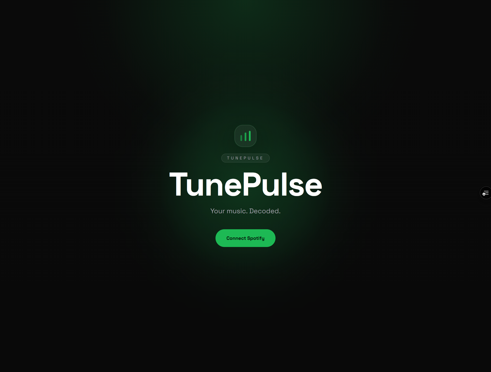
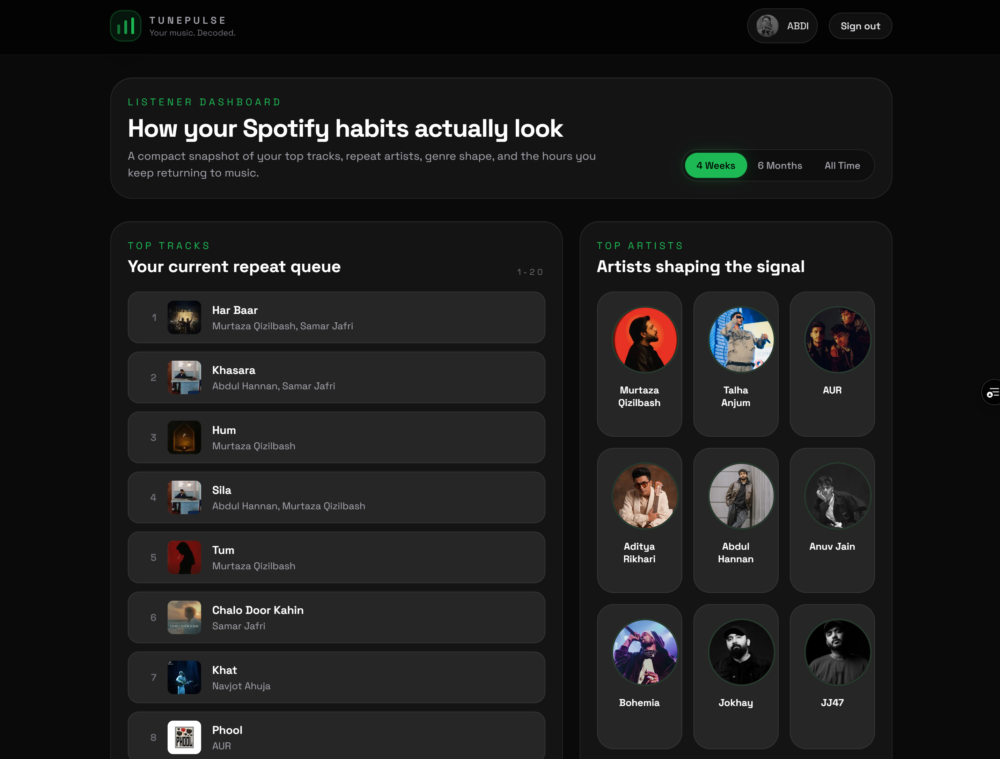
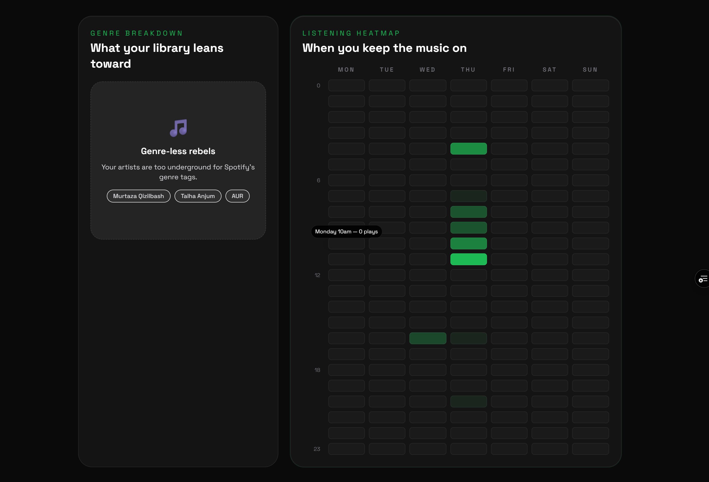
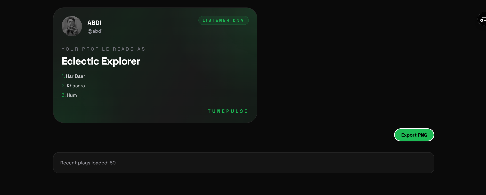

# TunePulse — Spotify Listening Stats App

TunePulse is a dark, data-rich Spotify analytics app that turns your listening history into a polished dashboard. It highlights your top tracks, favorite artists, genre breakdown, listening heatmap, and a personality card you can export as an image.

**Live URL:** https://tune-pulse-ten.vercel.app

## Features

- Spotify OAuth login with automatic token refresh (NextAuth.js)
- Top 20 tracks and top artists across 3 time ranges (4 Weeks, 6 Months, All Time)
- Genre breakdown radar chart with pill badges
- Listening heatmap (72h coverage, hour × day grid) from paginated recently played data
- Shareable personality card with PNG export via html2canvas
- Glassmorphism UI with staggered fade-up animations and sliding tab indicator
- SVG favicon, branded landing page, and equalizer logo

## Tech Stack

- Next.js 16 (App Router, Turbopack)
- React 19
- TypeScript
- Tailwind CSS v3
- NextAuth.js v4
- Recharts
- html2canvas

## Screenshots






## Setup

### 1. Clone the repository

```bash
git clone https://github.com/abdulhayykhan/TunePulse.git
cd TunePulse
```

### 2. Install dependencies

```bash
npm install
```

### 3. Create a Spotify Developer app

Go to https://developer.spotify.com/dashboard → Create App

- Add redirect URI: `http://localhost:3000/api/auth/callback/spotify`
- Enable: Web API
- Copy your Client ID and Client Secret

### 4. Configure environment variables

Create a `.env.local` file in the project root:

```env
NEXTAUTH_URL=http://localhost:3000
NEXTAUTH_SECRET=your-nextauth-secret
SPOTIFY_CLIENT_ID=your-spotify-client-id
SPOTIFY_CLIENT_SECRET=your-spotify-client-secret
```

Generate `NEXTAUTH_SECRET`:
```bash
node -e "console.log(require('crypto').randomBytes(32).toString('hex'))"
```

### 5. Run the development server

```bash
npm run dev
```

Open `http://localhost:3000` in your browser.

## Deployment

Deploy on Vercel — import the repo, add the same environment variables, and add your Vercel URL as a redirect URI in the Spotify Developer Dashboard.

## 📄 License

This project is open-source and available for educational and commercial use under the MIT License.

---

**Made with ❤️ by [Abdul Hayy Khan](https://www.linkedin.com/in/abdulhayykhan/)**